.. _configuration:
   
Configuration
=============

The module requires certain initial configuration to be done in
`magento instance`_ to set the management tool.

.. _magento instance:

**Magento Instance**
---------------------

Go to ``Magento`` and and click *Magento Instances* on the
left menu.

It refers to a magento installation identifiable via setting the API for
``Magento Site URL``, ``API User`` and ``API Password / Key``

1. Create a new ``magento instance`` by clicking create.

    .. image:: _images/create_magento_instance.png
       :width: 800

   Give the Magento Instance a title(i.e. Name), company and API settings which
   includes magento site URL, API user and API password. Magento Site URL is the
   URL used to access Store pages. You can set it on a per Store basis.

2. After filling the record, now click on the ``Save`` button to save the
   record.

3. After this, the Connection can be tested by clicking on  ``Test Connection``
   button at the bottom.

4. If the connection with magento is successful, a window will pop-up
   showing successful installation:
    
    .. image:: _images/test_connection.png
       :width: 800

5. Now the websites can be imported from Magento by clicking
   ``Import Websites`` button from magento. This will import all the websites
   for this magento instance. By clicking this, a new window will pop-up as
   a confirmation for importing websites as shown below:

    .. image:: _images/import_websites.png
        :width: 800
       

    **It will also import all the order states, website stores and store views
    related to this website.**

  5a. *Order States*: This allows the user to configure the states mapping
  according to his/her convenience. This map is used to process orders in
  tryton when they are imported. This is also used to map the order status on
  magento when sales are exported. This also allows the user to determine in
  which state he/she wants the order to be imported in. See below, all order
  states after imported website:

  User can use the default order state map, Refer `table`_ for default
  order states. The states map can be changed by his/her convenience.

    .. image:: _images/order_states.png
        :width: 800
        :align: center

  .. _table:

  ============================   =================================
        Magento State                    Tryton State
  ============================   =================================
            New                          Sale Quotation
            Cancelled                    Sale Cancelled
            Closed                       Sale Done
            Complete                     Sale Done
            Processing                   Sale Processing
            On Hold                      Sale Quotation
            Pending Payment              Invoice Waiting
            Payment Review               Invoice Waiting
  ============================   =================================
          
  5b. Imported all the websites of this magento instance:
        
    .. image:: _images/import_websites.png
        :width: 800
        :align: center
           
  5c. Click on the ``Instance Website`` on the left menu, it shows the websites
  for its respective magento instance.

    .. image:: _images/imported_websites.png
        :width: 800
        :align: center

  5d. All the webstores of the imported websites, also get imported, go to
  ``Website Store`` on the left menu:

    .. image:: _images/imported_stores.png
        :width: 800
        :align: center

  5e. Go to ``Website Store View`` to get all the store views of respective
    stores:

    .. image:: _images/imported_store_views.png
        :width: 800
        :align: center

6. ``Import Carriers/ Shipping Methods``: It will import and refresh index of
   all the carriers from Magento to Tryton, see below :
   
   .. image:: _images/import_carriers.png
      :width: 800
      :align: center

   Click on ``Import Carriers/ Shipping Methods`` button, it will import
   carriers from magento to Tryton, see below:

   .. image:: _images/import_carriers_wizard.png
      :width: 800
      :align: center

   .. image:: _images/imported_carriers.png
      :width: 800
      :align: center

During the import process, magento checks your data to ensure that it’s
correct.

After import, edit Magento Instance first to configure carrier. Just click on
carrier imported from the carriers list and edit as per the preference.

   .. image:: _images/configure_carriers.png
      :width: 800
      :align: center

   
7. ``Import Order States``: To Import orders and update state in the Tryton.
   Click on *Import Order States* button to get the states of magento to
   Tryton, it imports/refresh the order state but not any settings
   by user:
   
   .. image:: _images/import_order_states.png
      :width: 800
      :align: center
      
   During import, the states in Tryton will get mapped accordingly to magento
   states. Refer `table`_ again to understand the Magento-Tryton states
   mapping. See below:

   .. image:: _images/import_order_states_wizard.png
      :width: 800
      :align: center

   .. image:: _images/order_states.png
      :width: 800
      :align: center
 
To know more about *Magento Website*, *Magento Store*, *Magento Store*, refer
`How To Use`_.

.. _How To Use:

How To Use
==========

This section will guide you to understand the usability of the Trytond
Magento module.

**Magento Website**
-------------------

A magento instance can have multiple websites. They act as *parents* of stores.

A website consists of one or more stores.

To manage your website you need to navigate to ``Magento``
and click on *Instance Website*.

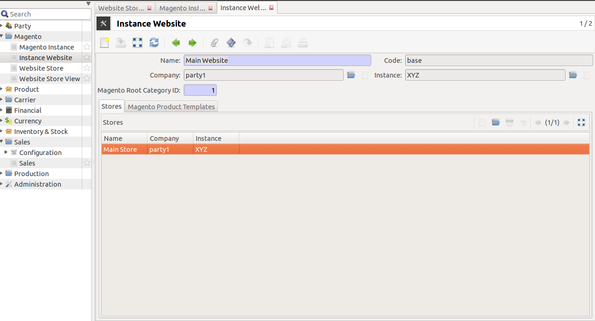

The above screen shows a website, where a bi-directional integration for
`import catalog`_, `update catalog`_, `export catalog`_ and `export_inventory`
can be easily done.

Below are the operations a user can perform through wizard:

* Import Catalog
* Update Catalog
* Export Catalog
* Update Catalog

.. _import catalog:

**Import Catalog**

Under Magento -> Instance Website, choose the desired website. Click on
``Import Magento Product Catalog``. This will import all the product
categories and products in a tree structure as on magento for this website,
see below screenshot:

.. image:: _images/import_catalog.png
   :width: 800
   :align: center
    
.. _update catalog:

**Update Catalog**

After Import the products catalog can also be updated, by clicking on the
``Update Catalog`` button. This will update the products, with details, like
name, default_code/SKU, description & prices.

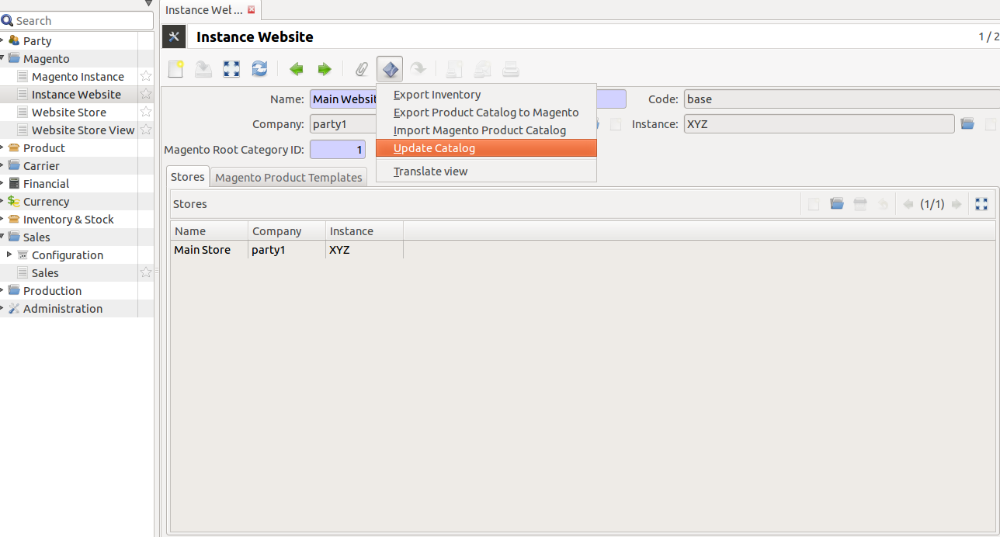

.. note::
   This behaviour can be easily extended by a developer as his needs

.. _export catalog:

**Export Catalog**

To export catalog, do the following:

1. Go to ``Magento >> Instance Website``, and choose a website to
   export its catalog, and click on ``Export Product Catalog To Magento``.

2. Now you have a popup screen, add information which you would like to export.
   This export the products of this current website.

   .. image:: _images/info_to_export_catalog.png
        :width: 800
        :align: center

3. Choose the magento catagory, which has been imported from the magento.

    .. image:: _images/choose_magento_category.png
        :width: 800
        :align: center

4. Select ``Attribute Set`` from drop-down menu, it shows the list of entity
   attributes belongs to the products you add:

    .. image:: _images/choose_attribute_set.png
       :width: 800
       :align: center

5. Now add products to export, this wizard take these products under the
   catagory choosen above:

7. Now after the items are selected, click on continue, this will load the
   exported products to magento:

.. _export inventory:

**Export Inventory**

Click on ``Export Inventory`` to export product stock information from Tryton
to Magento for the website.

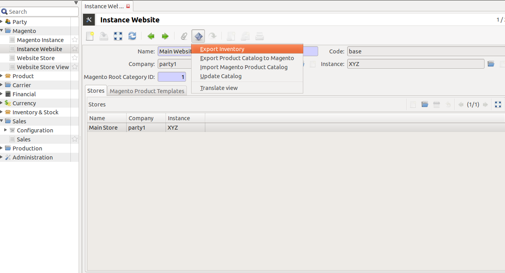

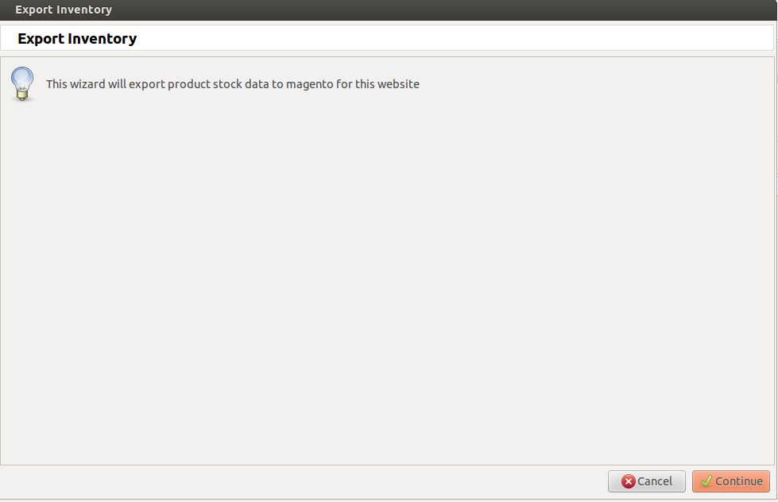
   
Click on the Continue button to export product stock data to magento for
website.

.. note:: 
   Each product in a website must be unique!

.. note::
   A website must be unique in an magento instance

.. _website store:

**Website Store**
-----------------

``Magento Website Store or Store view groups``

Go to ``Magento`` and open *Website Store*.

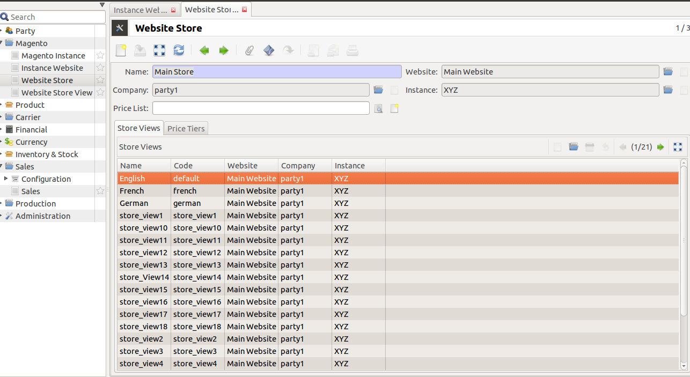

Stores are ``children`` of websites. The visibility of products and categories
is managed on magento at store level by specifying the root category on a store.
A store can have multiple store views.

.. note::
    A store must be unique in a website

Now, click on any store, there is ``Export Tier Prices`` button,

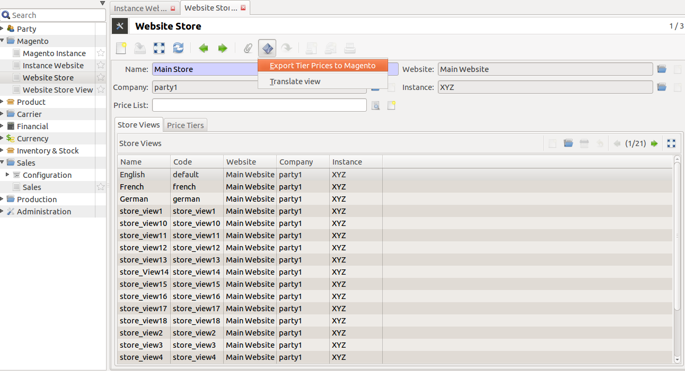

What is Price Tier?

Price Tier on a source represents the default value to be used while sending
tier prices for a product from Tryton to Magento. The product also has a
similar table like this on Magento. If there are no entries in the table on
product, then these tiers are used.

| **Now what is tier pricing?**

Tier pricing is a tool that lets you price items differently for higher
quantities. For example: you sell stationary supplies and you want to create a
promotion where customers who buy three paper products save money compared to
buying just one. Now import this tier prices to magento store:

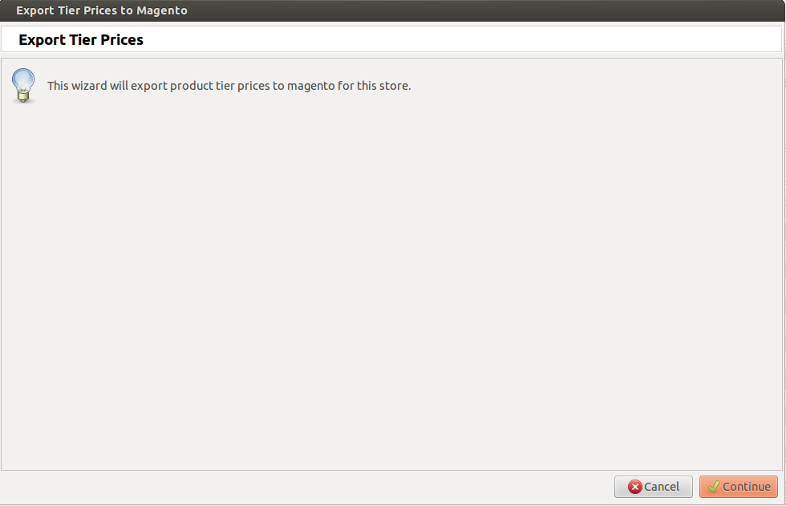

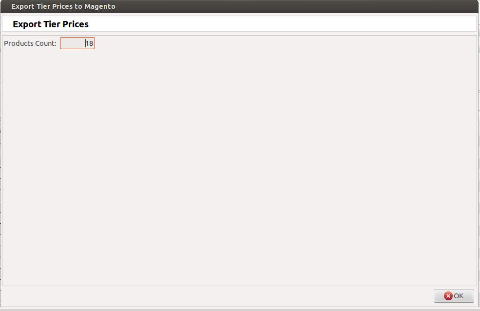
   
.. _store view:

**Store View**
--------------

``Magento Website Store View``

Go to ``Magento`` and open *Website Store View*.

A store needs one or more store views to be browse-able in the front-end. It
allows for multiple presentations of a store. Most implementations use store
views for different languages.

See screenshot below, it will get all the ``Store View`` with corresponding
``Store``

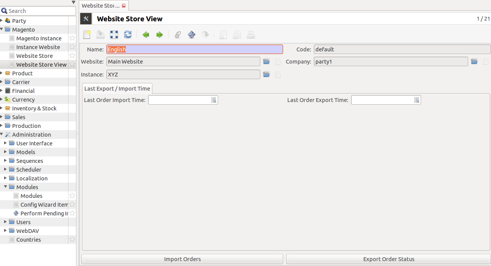

Open any store view for `Import Orders`_, `Export Order Status`_, and `Export
Shipment Status`_

.. _Import Orders:

**Import Orders**

This will import all sale orders placed on this store view on magento.

.. image:: _images/import_orders.png
   :width: 800
   :align: center

Clicking over ``Import Orders`` opens up a wizard that asks to import
orders.

.. image:: _images/import_order_wizard.png
   :width: 800
   :align: center

Clicking on continue will import all the sale orders from magento
for current store view. It will open up view for sale orders being
imported.

.. image:: _images/imported_orders.png
   :width: 800
   :align: center

If date is specified for ``Last Order Import Time`` , then it will import
sale orders updated after that date.

.. _Export Order Status:

**Export Order Status**

This will export order/shipment status to magento for this tryton store, it
will export all the edited/updated shipments, if ``Export tracking Information``
check box is checked, as checking this will make sure that only the done
shipments which have a carrier and tracking reference are exported. This will
update carrier and tracking reference on magento for the exported shipments as
well.

.. image:: _images/export_order_status.png
   :width: 800
   :align: center

Clicking ``Export Order Status`` opens up wizard that will ask to export
order status.

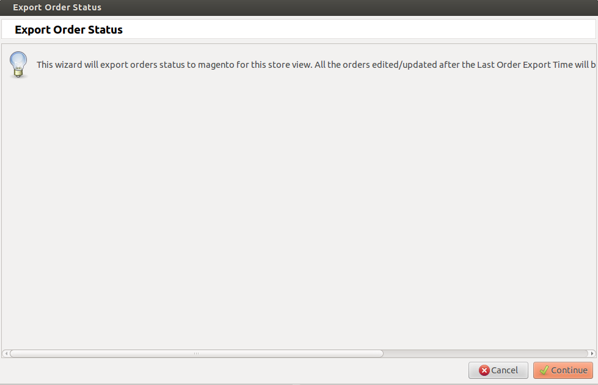

Clicking continue will export status of all sale orders to magento for current
store view.

If ``Last Order Export Time`` is specified, it will export status of sale
orders updated only after this time.

.. _Export Shipment Status:

**Export Shipment Status**

This wizard will export shipment status of all shipments related to this store
view. To export tracking information also for these shipments dont forget
to check the checkbox for ``Export Tracking Information`` on store view.

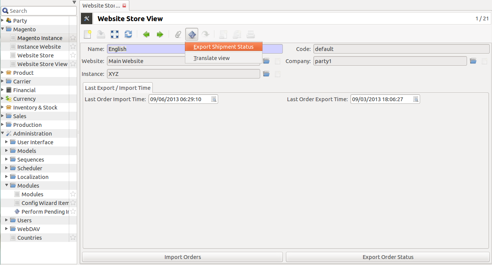

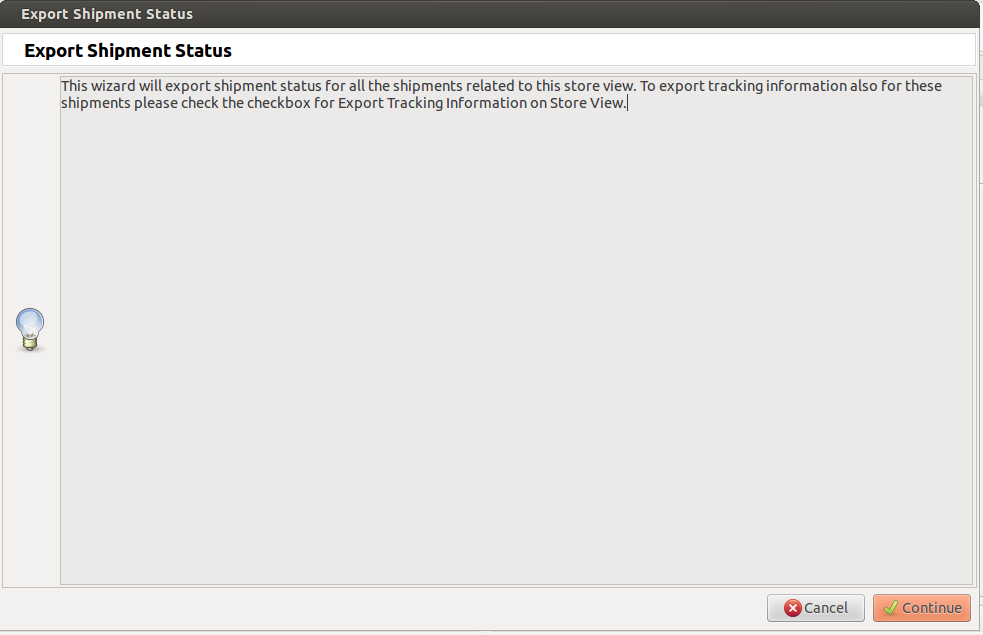
