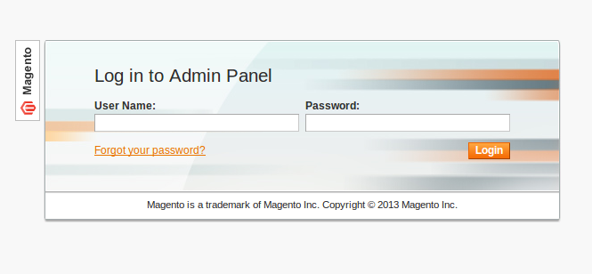
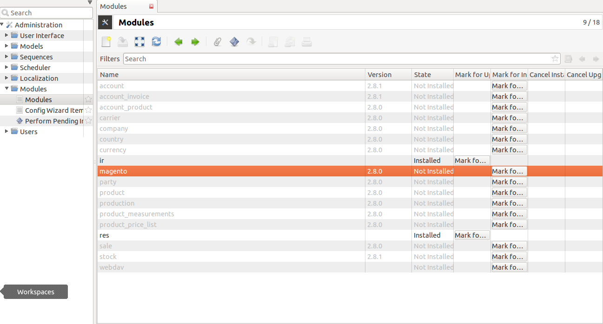
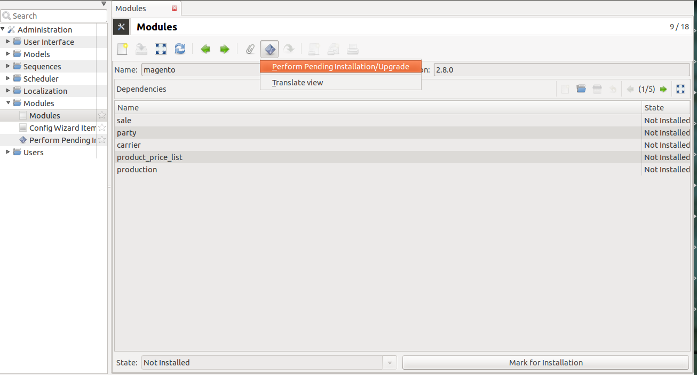
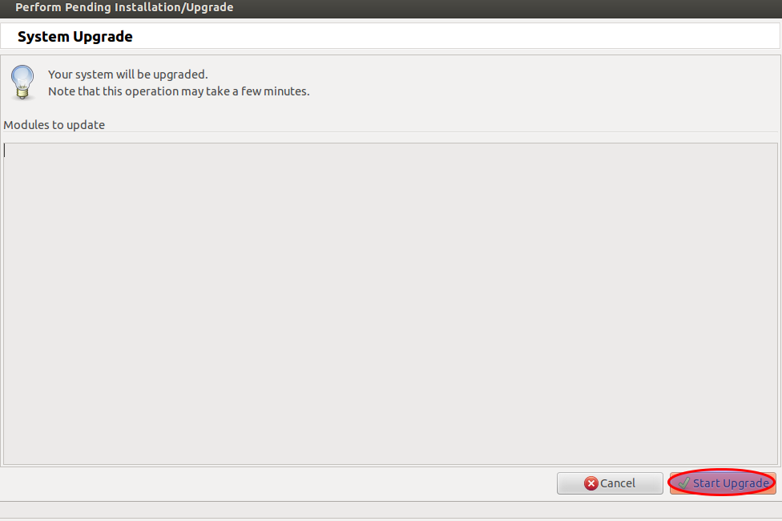

Introduction
============

Magento is a feature-rich eCommerce platform built on open-source technology
that provides online merchants with unprecedented flexibility and control over
the look, content and functionality of their eCommerce store. It comes with a
variety of tools, necessary for building a successful online shop.

A new bridge between Tryton and Magento has been initiated by Openlabs team.
This module allows synchronization of Magento with Tryton. It
supports Synchronization of Customers, Addresses, Product Categories, Products,
Order Status, and Orders.

This tutorial will guide you through installation, setup and configuring
magento integration module. To start with this see `Installation`_ first.

.. _installation:

Installation
============

Install Trytond Magento integration module by following the listed steps.
Continue reading to know more.

Installation of Magento Core API extension
++++++++++++++++++++++++++++++++++++++++++

The steps which you must follow in order to complete the Trytond Magento
Integration installation are:

**Step 1: Installation of Magento core API extension**

1. Log in to Magento Admin Area:

2. After login to magento Admin Panel,

Now go to ``System >> Magento Connect >> Magento Connect Manager`` , click it
and you will be taken to a login page, The Magento Connect Manager section
allows you to edit settings for installation:

    .. image:: _images/goto-magento-connect-manager.png
       :width: 800
       :align: center

2. A new page will open for the Magento Connect Manager and you will be asked
   to provide your administrative credentials again. Key in your username and
   password, the same username and password you entered while login to magento:
    
    .. image:: _images/login-magento-connect-manager.png
       :width: 800
       :align: center

3. Once logged in you will see 2 sections: Extensions and Settings. It is
   recommended to verify the options chosen in the Settings section first.
   Click on the ``Settings`` tab and change preferred state to 'Beta'.
   (As of this date the plug-in is beta). Save your settings:

   .. image:: _images/set-to-beta.png
      :width: 800
      :align: center

.. note::
   Default state is ``Stable``, change it to ``Beta``.

4. Go to the first tab i.e., ``Extensions`` to install magento-connector,

    .. image:: _images/magento-connect-manager.png
       :width: 800
       :align: center

5. The following is the `extension key`_ that you need to copy and paste in
   your Magento Connect area; it will be used for installing the
   magento-connector: 

.. _extension key:

  | **http://connect20.magentocommerce.com/community/Openlabs_OpenERPConnector**

    .. image:: _images/extension-key.png
       :width: 800
       :align: center

6. Once you have chosen an extension key, click Install, and wait for the
   module to appear for installation with Magento Connect version matching
   your current Magento version:

    .. image:: _images/loading.png
       :width: 800
       :align: center

7. Install it by clicking ``Proceed``, refer below screenshot:

    .. image:: _images/confirm-key.png
       :width: 800
       :align: center

8. The new extension will be automatically downloaded and installed. If there
   is a problem with the installation, there will be information about it so
   that you know what should be done to resolve it. After the extension is
   properly installed a screen for a successful installation will appear:

   .. image:: _images/terminal-refresh.png
      :width: 800
      :align: center

9. To check the installed module, go to bottom of your page as it is located at
   the end of the list, see below:

    .. image:: _images/module-installed.png
       :width: 800
       :align: center

Installation of Magento Integration [Tryton module]
+++++++++++++++++++++++++++++++++++++++++++++++++++++

**Step 2: Installation of Magento Integration [Tryton module]**

**Downloading the module**

1. The module source is available online and can be downloaded from:vsp
   `here <https://github.com/openlabs/trytond_magento>`_.

2. The module can be downloaded as a `zip` file or can be `cloned` by running

    .. code-block:: sh

        $ git clone https://github.com/openlabs/trytond_magento.git

    OR

    .. code-block:: sh

        $ git clone git@github.com:openlabs/trytond_magento.git

3. If the module is downloaded as a zip file, extract the module which will
   give a directory.

4. From the module directory, use the setup.py script with the command:

   .. code-block:: sh

        $ python setup.py install

**Installing the module in Tryton database**

Run Trytond Server
------------------

    .. code-block:: sh

        $ trytond -c <path-to-trytond-configuration-file>

Run Tryton client
-----------------
    .. code-block:: sh

       $ tryton

    This will display a login window

    .. image:: _images/tryton_client.png
        :width: 500
        :align: center

    Close this window and go to ``File >> Database >> New Database`` to
    create database for trytond magento connector.

    .. image:: _images/create_database.png
        :width: 500
        :align: center
    
    It will open a window, which will prompt you to fill the database details.

    .. image:: _images/new_database.png
        :width: 500
        :align: center

Login to Tryton
----------------

Now login with created database and configure tryton using configuration
wizard displayed.

Now go to ``Administration >> Modules`` and click on Modules that will open
list of all modules installed.

Now Click on the Magento module, mark for installation and perform pending
installation/upgrade as shown below:

.. image:: _images/mark_for_installation.png
    :width: 1000
    :align: center

Clicking the icon shown above  will open a wizard to start upgradation.
Click on Start Upgrade as shown below and the module is ready to use.

