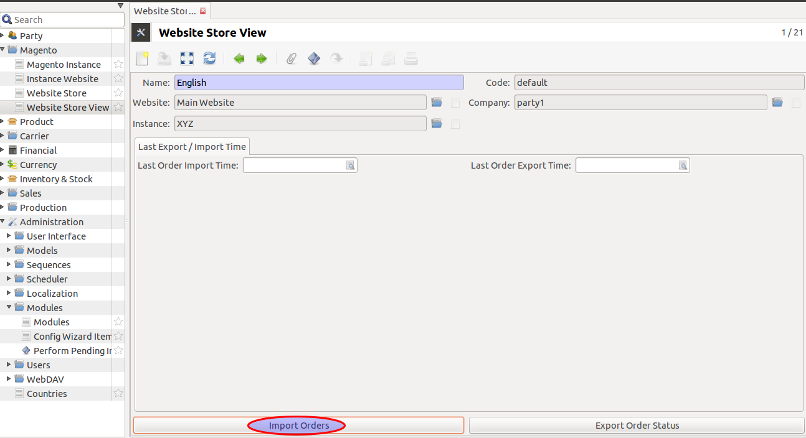
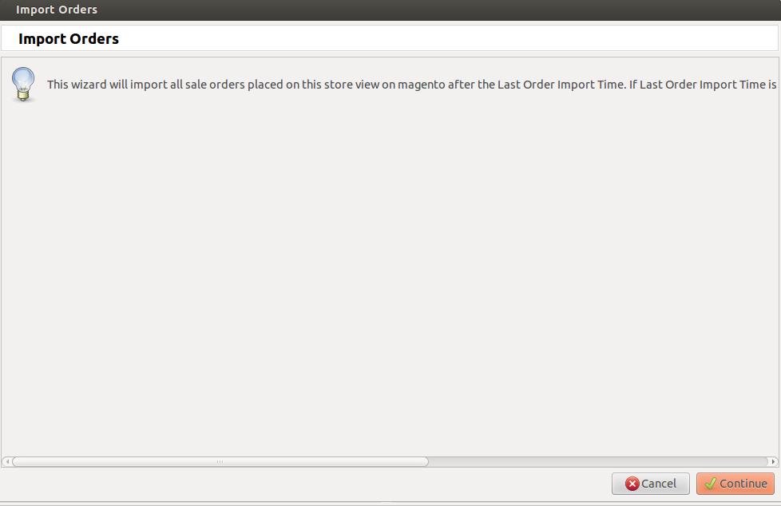
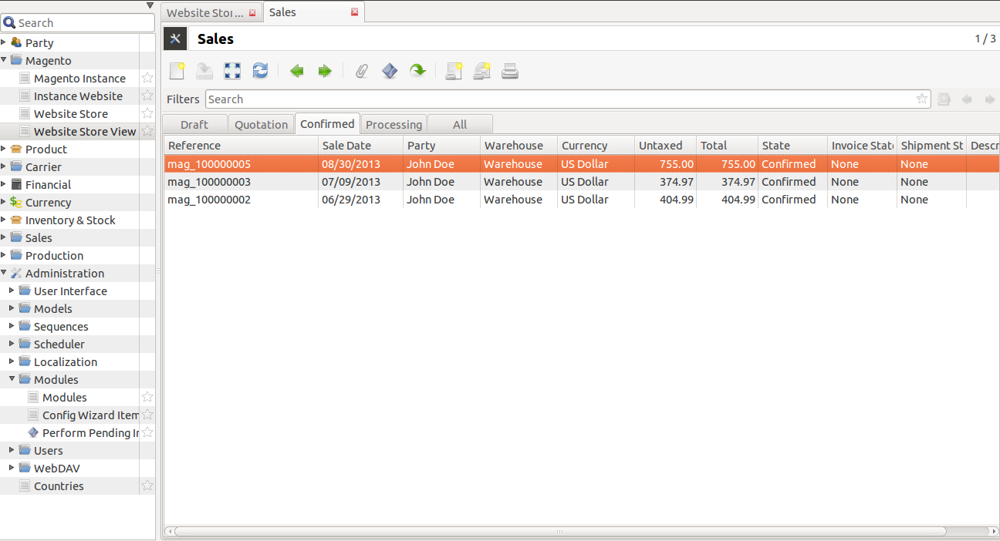
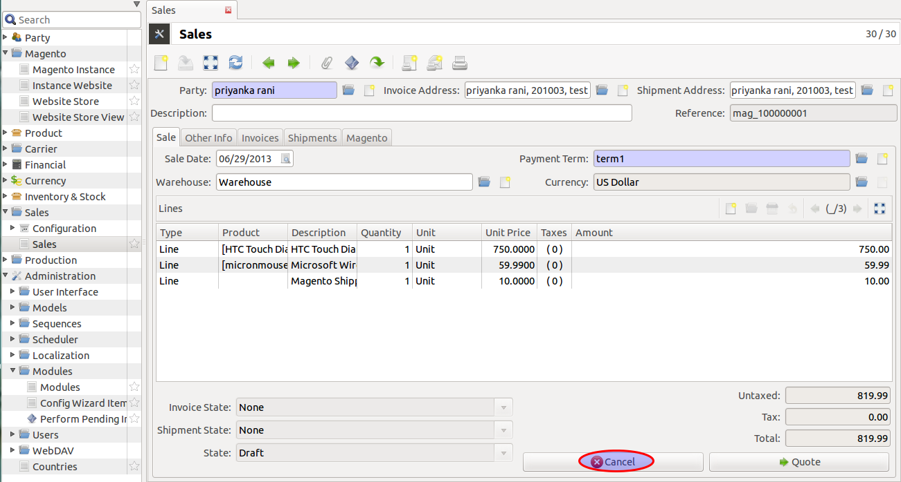
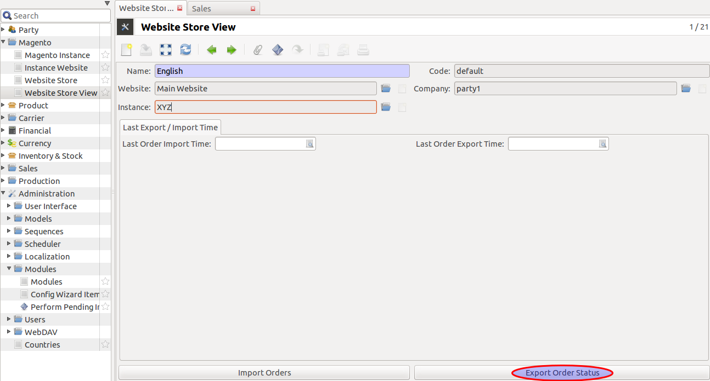

How it Works
============

This section explains how import and export of orders between Tryton and
Magento works, first lets start with creating the sale orders:

Create Sale Orders in Magento
-----------------------------

In Magento Admin Panel's sales, clicking on the [Create New Order] button
will allow you to add sale orders to your products, the order process consists
of several simple steps. You start by adding an item to the cart, then proceed
to checkout, select a checkout method, fill in some billing and shipping
information, select a payment method and then place the order. See below to
`Create New Order`_.

.. note::
   All the data represented below is demo data and is only for demonstration
   purposes.

.. _Create New Order:

**Sale in Magento**

.. image:: _images/sale_orders1.png
   :width: 800
   :align: center

**Orders in Magento**

You can review all your orders from the Magento admin area > Sales > Orders. In
the previous section we placed list if orders, so let's click on it to see how
it looks like:

.. image:: _images/sale_orders2.png
   :width: 800
   :align: center

Orders are imported as Sales
----------------------------

Orders placed in Magento Admin Panel are imported in Tryton from ``Store
View``. See below:

An order in Magento has a number of entities related and they are
imported in Tryton as described below:

* The Order is imported as a Sale. The sale in Tryton can be identified by
  the Order Number which will be same as the order reference in Magento.
  Internally the matching is done using the ID of the order as returned by
  Magento.

* The date on which its order is generated

* The Customer who placed the order as a Sale.

* The products, i.e., the products bought in the order by the customer are
  imported as Sale lines. The product in each of these lines is created as
  product in Tryton, if it does not already exist.

A window pop-ups to import all sale orders placed on this store view.
Enter Continue, refer screenshot shown below:

**Order imported as Sales in Tryton**

| ``Sales >> Sales``

.. note::
   When the order import happens next time, the status of the orders in
   state in Tryton will be updated if there is a change in state on Magento.

Cancellation Of Sale Order
--------------------------

You can edit an order by clicking on it and modify it to your preference. The
cancel the order click over ``Cancel``:

Now state has been changed to cancelled, see below

**Cancelled Sale Order**

.. image:: _images/sale_cancelled.png
   :width: 800
   :align: center

Now to export the changes to Magento, refer `export order`_

.. _export order:

Exporting Order Status from Tryton to Magento
----------------------------------------------

Once the order is processed in Tryton, the shipping status of the order
based on delivery is updated on Magento by Export Order.

This will export order's status to magento for this store view

* The status of orders which are imported in Tryton will be exported to
  Magento as `Cancelled` once they are marked `Cancelled` by editing sale order
  from Tryton.

.. note::
   This feature is currenctly available for Cancelled Orders
